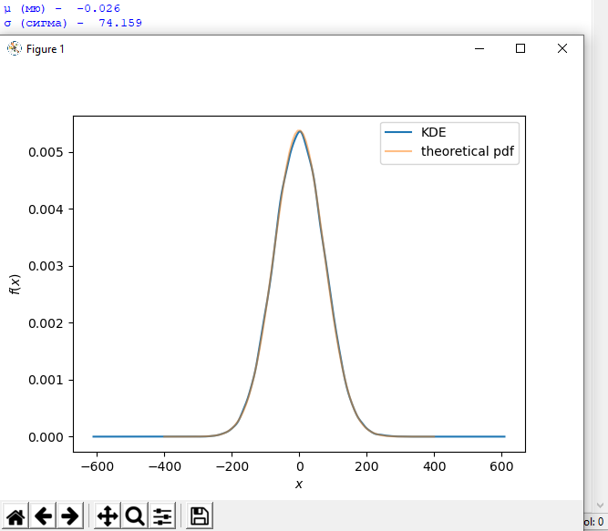
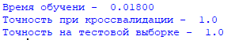
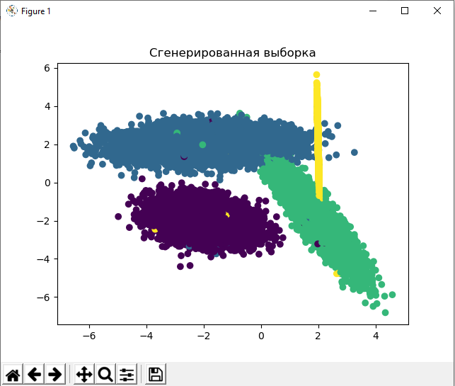
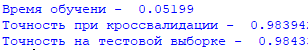
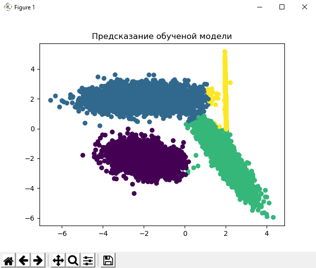

# Bayesian Inference

Этот модуль позволяет решать задачи регрессии и классификации используя алгоритмы основанные на теореме Байеса, BayesianRidge и naive_bayes соответсвенно. Можно использовать свои данные или же сгенерировать с помощью методов модуля.

#### Библиотеки необходимы для работы модуля:

* numpy
* pandas
* scipy
* matplotlib
* sklearn

### Пример решения задачи регрессии

    import bayesianInference.regression as BI

Сгенерируем выборку методом "makeData" который имеет такие параметры: size - размер выборки (по умолчанию - 50000), features - кол-во признаков (по умолчанию - 2), informative - кол-во информативных признаков (по умолчанию - 2). Также можно вывести график оценки плотности распределения, с параметрами μ и σ: мю - мат. ожидание, сигма - среднеквадратичное отклонение.

    x, y = BI.Regression.makeData()
    BI.Regression.distribution(y)

Обучим модель передав в нее выборку. Будет возвращено: модель, времяя обучения, точность при кроссвалидации, точность при обучении (на тестовых данных). Выборка разбивается на тренировочную и тестовую как 70 на 30.

    model = BI.Regression(x, y)
    mod, time_tr, score_cross, score_train = model.training()
    print("Время обучени - ", '%.5f'%(time_tr))
    print("Точность при кроссвалидации - ", '%.4f'%(score_cross))
    print("Точность на тестовой выборке - ", '%.4f'%(score_train))
    

### Пример решения задачи классификации

    import bayesianInference.classification as NB
    
Сгенерируем выборку методом "makeData" который имеет такие параметры: size - размер выборки (по умолчанию - 50000). Кол-во признаков - 2, кол-во классов в ответах - 4. Также выведет график с распределением классов.
    
    x, y = NB.Classification.makeData()
    

Обучим модель передав в нее выборку. Будет возвращено: модель, времяя обучения, точность при кроссвалидации, точность при обучении (на тестовых данных). Выборка разбивается на тренировочную и тестовую как 70 на 30.

    model = NB.Classification(x, y)
    mod, time_tr, score_cross, score_train = model.training()
    print("Время обучени - ", '%.5f'%(time_tr))
    print("Точность при кроссвалидации - ", score_cross)
    print("Точность на тестовой выборке - ", score_train)
    

Ответы на тестовой выборке.

